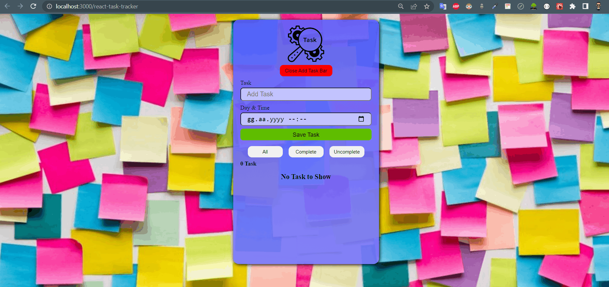

## Check The Live Website ➡️ [Live Website](https://osmankoyuncuu.github.io/react-task-tracker/)

## Animation of the Website

## Description

Project aims to create a task tracker.

## Project Skeleton

    react-task-tracker
    |
    ├── public
    │     └── index.html
    │     └── favicon.ico
    ├── src
    │    ├── assets
    │    │       ├── background.jpg
    │    │       └── TaskPng.jsx
    │    ├── components
    │    │       ├── AddTask
    │    │       │     ├── AddTask.css
    │    │       │     └── AddTask.jsx
    │    │       ├── Filter
    │    │       │     ├── Filter.css
    │    │       │     └── Filter.jsx
    │    │       ├── Header
    │    │       │     ├── Header.css
    │    │       │     └── Header.jsx
    │    │       ├── ShowHideButton
    │    │       │     ├── ShowHideButton.css
    │    │       │     └── ShowHideButton.jsx
    │    │       └── TaskList
    │    │             ├── TaskList.css
    │    │             └── TaskList.jsx
    │    ├── App.js
    │    ├── App.css
    │    ├── index.js
    │    └── index.css
    ├── .gitignore
    ├── package.json
    ├── task-tracker.gif
    ├── README.md
    └── yarn.lock

## Overview

I mastered HTML, CSS and React features in this project. You can see the visual representation of the website above.
